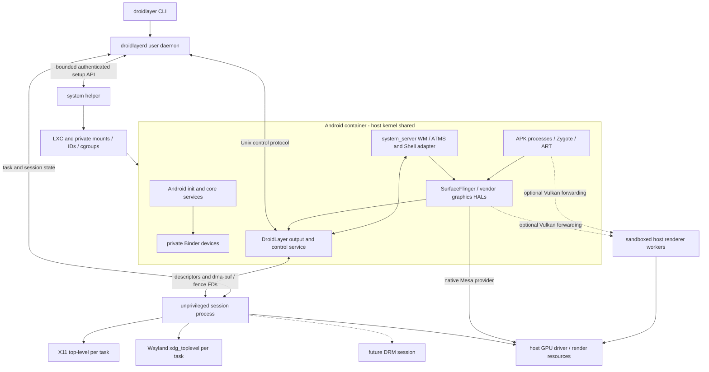
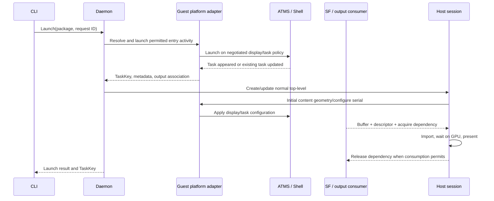
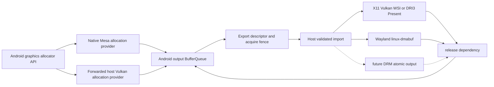

# DroidLayer architecture

Status: **design proposal, no implementation**. Baseline: AOSP
`android-17.0.0_r1`, x86_64, one persistent Android instance per Linux user.
[RESEARCH.md](RESEARCH.md) explains evidence; [ADRs](adr/README.md) distinguish
accepted requirements from proposed mechanisms. An engineer should read this
document, the relevant ADR and the selected plan task before touching code.

## Architecture and trust boundaries



The two renderer arrows are alternatives selected by a negotiated GPU provider,
not simultaneous requirements. The output boundary between SF and the guest
service is **unverified**: A1 virtual display per task is the first candidate;
A2/D1 remain alternatives. [ADR-0007](adr/0007-task-window-mapping.md)

All processes share the Linux kernel. Containers are not VM-strength kernel
isolation. The major unresolved security boundary is SELinux: Android cannot
load an independent policy inside ordinary namespaces. A production enforcing
host integration is a prerequisite to resolve, not a box labeled “SELinux” that
LXC automatically provides. [ADR-0014](adr/0014-selinux.md)

## Process responsibilities

| Process | Authority and owned state | Must not own |
|---|---|---|
| CLI | Current user's requests, APK source FD, output formatting | Root operations, desktop windows or Android private Binder calls. |
| System helper | Root-owned image selection, LXC config, mount/device/network/cgroup setup, instance PID/namespace handles, cleanup ledger | GPU command decoding, arbitrary user hooks, desktop connections, raw user shell commands. |
| User daemon | Instance state machine, authenticated Android control, task registry, configuration policy and session attachment | Root/capabilities, X11/Wayland types, driver-specific buffer layouts. |
| Session process | Display connection, task-window map, host input, presentation/import objects, later desktop integrations | Container mount policy or authority to start arbitrary privileged operations. |
| Renderer workers, if used | Bounded guest GPU contexts, selected host driver FDs, allocation/export operations | Helper privileges, host files/desktop bus/display socket. |
| Android platform adapter | Shell task events, launch/resize/focus policy, Android input/intents/package calls under platform permissions | Arbitrary host filesystem access or unrestricted host actions from APKs. |
| Android native output service | BufferQueue consumer, allocator metadata, output generations, acquire/release fence ownership | Host window protocol decisions. |

The daemon and session code may initially be separate modules/modes of one
unprivileged binary. Preserve explicit interfaces so renderer/display failures
can later be isolated without rewriting lifecycle code. The helper is a separate
process from the first privileged implementation. One active graphical session
attaches to an instance initially; reject ambiguous competing session attachment
instead of duplicating input ownership. Data persists after session/instance stop.

## Module and repository growth

M1 creates only a small Cargo workspace: CLI, daemon/core and IPC as warranted by
actual code. Add a helper/container crate when M3 needs privileged orchestration;
add graphics/session/X11 and Wayland modules as their prototypes become code.
Split crates when they have independent API/testing or unsafe/native dependency
boundaries. Do not create empty crates for every future integration.

Future directories are `android/product`, `android/patches`, `android/services`,
`tests/android`, `packaging/arch` and `tools`. AOSP checkout/build outputs live
outside this small repository. Every AOSP patch records base project/revision,
reason, tested module and upstreamability. No host patch should require rebuilding
the Android image.

Interface rules:

- Core uses TaskKey, InstanceGeneration, geometry, lifecycle requests and host
  capability records; no XCB/Wayland/Binder/native_handle types.
- Graphics uses validated BufferDescriptor, OwnedFd resources, AcquireDependency,
  ReleaseDependency, DeviceIdentity and backend presentation handles. It does not
  infer task ownership from pixels or layer names.
- Container code accepts validated image/profile/device choices, not host display
  objects or arbitrary LXC configuration strings.
- Android integration is versioned behind the guest protocol. Internal AOSP
  Java/NDK APIs remain inside the image built against that exact platform.
- Desktop bridges translate permission-aware requests through the session process;
  they do not pass the host desktop bus into Android.

## Persistent storage and instance identity

Proposed roots: helper-owned immutable images under `/var/lib/droidlayer/images`,
private per-UID Android volumes under `/var/lib/droidlayer/users/<uid>`, and
ephemeral privileged instance resources under `/run/droidlayer`. User configuration
uses `$XDG_CONFIG_HOME/droidlayer`; user sockets use `$XDG_RUNTIME_DIR/droidlayer`
with restrictive permissions. These are design paths, not directories created
by this run. The helper validates references against its managed store.

An instance has a persistent data identity and a fresh random boot generation.
TaskKey combines generation, Android user and task ID. Buffer IDs and output
IDs also carry generations. A restored task ID is never confused with an old
session's task. Image format/protocol versions and data schema compatibility
are separate; image rollback cannot imply safe data rollback.

## Binder lifecycle

1. Helper serializes start operations for the Linux UID and verifies the selected
   immutable image and security profile.
2. Create the instance mount namespace and a fresh binderfs mount, with a bounded
   device limit and no global statistics exposure.
3. Issue BINDER_CTL_ADD for the closure-required contexts; record dynamic device
   numbers. Apply mapped ownership, mode, cgroup allowance and approved labels.
4. Bind required nodes to guest conventional paths; expose compatible read-only
   feature information. Do not expose binder-control or another user's devices.
5. Android servicemanager/other required managers establish their contexts. Host
   control continues through Unix sockets; no host Binder protocol stack.
6. On stop, terminate/reap Android, close references, unmount guest bindings,
   remove instance device names and unmount binderfs. A cleanup ledger permits
   idempotent recovery after partial start/helper restart.

Both C and Rust kernel Binder are valid if the required UAPI tests pass.
[ADR-0004](adr/0004-binderfs.md), [SPIKE-001](SPIKES.md#spike-001)

## Startup and readiness

```mermaid
sequenceDiagram
  participant C as CLI
  participant D as User daemon
  participant H as System helper
  participant A as Android init/services
  participant G as Guest adapter
  participant S as Session process
  C->>D: Start(request ID)
  D->>H: StartInstance(image, profile, device choice)
  H->>H: Verify caller/profile; prepare private resources
  H->>A: LXC start prepared Android init
  A->>A: Activate services, APEX, Android user
  G->>D: Authenticate; Hello(image/protocol/capabilities)
  D->>G: Health probes and task snapshot
  D->>S: Attach selected graphical session
  S->>G: Negotiate output import and synchronization
  D-->>C: Ready or structured stage failure
```

State machine: Stopped → Preparing → Booting → ServicesReady → SessionReady.
Failed includes a precise stage/reason and owned-resource recovery state.
Headless control can reach ServicesReady without a session. `start` completion
semantics must clearly report whether graphical readiness was requested.

Health checks include Binder manager responsiveness, package manager query,
ATMS/WM/display/input operation, Zygote/app launch ability and usable unlocked
data. Report boot_completed as one observation, not the only condition. Timeouts
are stage-specific and cancellation cleans only the current instance's resources.

## Install and application launch

`install` opens a local APK as an FD, validates bounded metadata and ABI policy,
then streams/stages it to a guest package-install session. Android verifies
signatures/permissions. No shell interpolation of host paths or package names.
Split APKs may be added later through explicit session semantics. Reject ARM-only
native requirements clearly rather than treating extraction success as support.



Launch success means Android accepted/resolved a task; readiness of the first
presented frame is a separate event/optional wait. Existing tasks, new task IDs,
permission prompts and launch failures must be reported accurately. A host close
request removes/finishes the mapped task according to Android policy. A separate
force-stop operation, if offered, explicitly affects the whole package.

## Proposed task output and window lifecycle

The initial hypothesis is a trusted virtual display with a guest-owned output
consumer for each application task. Shell listens to task events and coordinates
launch, reparent, bounds and configuration. A hidden/control primary display and
minimal composer HAL may be needed for Android boot; this must be validated and
must not become the only desktop window. Android SF retains effects/composition.

The unverified parts are display-per-task enforcement, existing/new task reuse,
which system/IME layers belong to an output, secure-layer exclusion and Android17
new versus legacy virtual-display behavior. [SPIKE-002](SPIKES.md#spike-002) may
replace this mechanism with task mirroring or targeted SF composition.

Proposed task state: Discovered → Configuring → Visible ↔ Hidden → Closing →
Removed. Process death need not remove a retained task. Input focus is an explicit
seat property, independent of visibility. Minimize is not force-stop.

Resize contract: host issues Configure(serial, content size, scale/state); guest
applies display/bounds changes and returns GeometryApplied with output generation
and inverse input transform. Present matching buffers when ready; keep or
letterbox the prior generation temporarily. Bound resize requests and coalesce
obsolete ones. Release old allocations only after consumers are finished.
Non-resizable/orientation-locked apps keep Android compatibility behavior.

Initially compose dialogs, popups and SurfaceView into the owning task output.
Do not create a host top-level for every Activity or internal layer. IME/system
permission dialogs need explicit ownership/modality policy and tests. True
separate Android tasks get separate host windows, including tasks in one package.

## Graphics providers and buffer ownership



Allocation ownership is negotiated through the provider. SurfaceFlinger and apps
use the guest mapper/allocator API; no generic host code decodes their private
native handles. The host GPU worker may be the actual allocator for NVIDIA, but
the Android wrapper must implement correct AHardwareBuffer/Gralloc usage and
fence semantics. A host-only dma-buf test does not validate that wrapper.

Forwarded renderer clients may be APK processes, unlike the privileged guest
control endpoint. Derive their mapped Android UID/context identity from validated
peer credentials or an authenticated Android broker, never a client-supplied UID.
Enforce allocation/context ownership and per-client budgets so one app cannot
reference another app's host-rendered buffers. Sharing the host renderer must not
erase Android's per-app resource separation. Test this independently of renderer
process sandboxing; a sandboxed worker can still leak data between its clients.

A buffer's lifecycle is Allocated → ProducerWriting → QueuedWithAcquire →
HostReading/Presented → ReleasedWithDependency → Reusable. GPU API calls may
consume transferred FDs; define each operation's ownership in its safe wrapper.
Do not reuse on acknowledgement of receipt, frame callback or presentation
timestamp. Multiple consumers require all release dependencies.

Core descriptor fields and validation rules are in research section 11; M1/M6
turn these into a wire specification. Start with SDR RGB/RGBA and a negotiated
pool limit. Reject unsupported/protected formats. Apply resource budgets by
instance/task and backpressure without holding system_server's event thread.

## X11, Wayland and future DRM presenters

X11 owns XCB connection/window IDs, ICCCM/EWMH, XKB/XInput handling and native
presentation objects. Start with import-and-GPU-draw to an X11 swapchain, then
test DRI3/Present direct buffers. Window-manager framing and content dimensions
are distinct. Multiple task windows are root children subject to the ordinary
WM, not child regions of one container UI. [ADR-0008](adr/0008-x11.md)

Wayland owns registry negotiation, xdg roles/configure serials, app_id/decorations,
seat/output/scale objects, linux-dmabuf feedback and explicit release timelines.
It is a client of the user's compositor. X11 nested Weston is a valid protocol
test environment; performance and compositor portability are separate tests.
[ADR-0009](adr/0009-wayland.md)

DRM later owns a seat/lease, card FD, connector/CRTC/plane state, atomic commits
and page-flip fences. Render nodes alone cannot modeset. This standalone mode
needs a minimal task layout/focus policy because there is no external window
manager. Prefer a small explicit session mode over a general compositor plugin
system. VKMS tests atomic mechanics; real scanout needs unused hardware or a
scheduled VT/lease. No desktop GPU takeover during normal development.

## Input and future integrations

Host events carry seat, TaskKey, output generation, monotonic time, focus serial,
coordinates and source kind. The guest adapter validates ownership and injects
through Android's input/display APIs. Apply scale/crop/rotation exactly once.
Distinguish physical keys from committed text, and track pressed state so focus
loss/disconnect cancels it. Guest Android policy continues to route dialogs/IME.

Later media bridges adapt Android audio/camera HAL contracts to host PipeWire
streams. Microphone/camera require explicit grants and revocation. Clipboard,
notifications, URI/MIME dispatch, files, portals, drag-and-drop and launchers
are authenticated adapters, not a shared host bus. A host portal commonly sees
DroidLayer as its caller; per-Android-app attribution/grants must be implemented
and disclosed rather than assumed to come from the portal automatically.

## Protocol and compatibility rules

Proposed packets: Hello/Capabilities, Health, InstallSession operations, Launch,
TaskSnapshot/TaskDelta, Configure/GeometryApplied, Focus/Input, BufferRegister,
FrameReady, FrameRelease, Error and Shutdown. Define FD counts/roles for each.
The helper protocol is smaller and separately versioned: inspect, prepare/start,
stop, query and recover managed instances. Renderer command transport has its
own version/security review.

Suggested initial limits for the implementation task to validate: 64 KiB control
packets, 16 ancillary FDs, bounded string/array/depth limits, at most four image
planes and three queued output frames per task. These are proposals, not wire
ABI. Use explicit endian encoding and header lengths, reject MSG_TRUNC/MSG_CTRUNC,
set CLOEXEC on receipt, and close every FD on rejected packets. Major-version
mismatch fails clearly; minor additions require negotiated capabilities.

Authenticate guest endpoints using helper-provisioned identity and protected
socket access, plus namespace-aware peer credentials. Validate instance generation
on every object reference. Platform signing is not host authority; a compromised
guest service must still be unable to ask the helper for arbitrary resources.

## Shutdown, suspend and recovery

Orderly stop: refuse new launch/install requests; release input capture and cancel
pressed events; quiesce presentation; ask Android to finish/flush services; drain
or destroy consumers with fences accounted for; request container shutdown;
reap processes; clean network/device/mount resources; leave persistent data.
Escalate after a bounded timeout only within the recorded instance PID/cgroup;
never identify targets through broad process-name matches. Stop is idempotent.

Session crash: keep instance/data, drop stale window mappings and input focus;
reconnect with a task snapshot and new output generation. Renderer crash: fail
the affected provider/contexts and recreate only after device-loss policy; do
not label uncertain GPU work complete. Guest crash: collect bounded diagnostics,
report failed stage, restart with rate limiting if configured. Helper restart:
reconcile its ownership ledger against live namespaces/cgroups and avoid reusing
an old generation accidentally.

Suspend/resume is a coordinated lifecycle event, not unconditional LXC freezer
use. Stop accepting input, quiesce streams/frames, preserve or rebuild GPU resources
according to driver behavior, then resynchronize task state, clocks, network and
desktop connections. Test stale fences and device loss; media clocks and Android
power assumptions need their own adapters.

## Diagnostics and readiness for implementation

Plan commands: `status`, `doctor`, `logs`, `gpu-info`, `container-info`. Stable
structured events include boot stage, instance/task/output generation, request
ID, service result, renderer/device choice, allocation format/modifier, fence
state and presentation latency. Default logs omit APK contents, text input,
clipboard, sensitive URIs and arbitrary Android logcat payloads. Support bundles
are explicit, size-bounded and redacted.

Doctor must detect Binder implementation/filesystem support, namespace/cgroup
delegation, approved MAC profile, image/API mismatch, LXC availability, failed
Android services, renderer/import/fence capabilities and desktop backend failures.
It reports remedies; it does not automatically disable security or replace GPU
drivers. Distinguish “not tested”, “unsupported”, “permission denied” and
“temporarily unavailable”.

No end-to-end feasibility claim is made until [M7](IMPLEMENTATION_PLAN.md#m7)
passes. Accelerated support needs M8, multi-task correctness M10, Wayland parity
M11 and production safety M15. Early spikes remain essential gates even when
their production implementation milestone is later.
