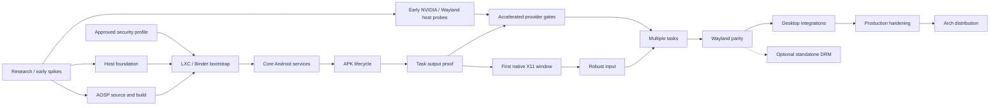

# DroidLayer implementation plan

Baseline: 2026-09-05. This is a task backlog, not a claim that DroidLayer runs.
Milestones are acceptance gates rather than dates. The first run delivers
research/planning only; all runtime work below is unimplemented.

## Workflow for coding agents

1. Read [ARCHITECTURE.md](ARCHITECTURE.md), relevant [ADRs](adr/README.md), and the
   current milestone before modifying code. Read repository instructions too.
2. Select an incomplete `[ ]` task whose dependencies are complete. A proposed
   ADR permits its validating experiment, not production reliance on an unproved
   assumption. Use explicit task prerequisites below.
3. Implement only that task and directly necessary supporting work. Keep it to
   one focused session; split at an observed coherent boundary if larger than
   expected, recording why. Long AOSP build execution may outlast interactive work.
4. Add or update meaningful tests for behavior, interfaces and failure modes.
5. Run the appropriate tests and validation. Record commands, versions, outcomes
   and hardware limitations; a skipped hardware test is not a pass.
6. Update documentation when behavior or architecture changes.
7. Change `[ ]` to `[x]` only when the task's acceptance criteria actually pass.
   Completing a spike with a negative result completes the investigation, not
   dependent implementation or the affected milestone's product acceptance gate.
8. Record important discoveries/deviations immediately beneath the task, with a
   result-document link for spikes. State unresolved risks and follow-up IDs.
9. Never mark future or unimplemented work complete. Documentation completion
   does not imply a runtime milestone passed.
10. If research disproves an ADR, stop depending on that assumption and update
    or supersede the ADR before continuing dependent work.
11. Leave the repository buildable/testable for the implemented scope; before
    Cargo exists, run documentation/tool validation. Do not invent successful
    runtime checks. Preserve unrelated changes.
12. Keep commit scope close to the selected task; include its ID and evidence.
    Do not publish/push/release merely because a local task is finished.

Within a milestone, tasks depend on preceding tasks unless an explicit `Deps:`
overrides that order. Milestone dependencies are defaults; explicit task-level
dependencies allow the stated early/parallel work. Do not parallelize changes to
the same Android checkout/output directory. “Record result” includes a failure
result; tasks claiming working behavior require that behavior to pass.

## Dependency map and release gates

M12–M14 integrations can start on a working X11 backend with their explicit
dependencies; finishing Wayland parity is required for a parity release, not
for every integration prototype. No audio/portal/Google-services work blocks M7.
M7 is the visible proof; M8 supplies acceleration evidence. Production claims
also require M15 security/recovery and the complete required hardware matrix.

## M0 — Research, environment and feasibility gates

**Objective:** replace architectural guesses with dated evidence and bounded spikes.
**Dependencies:** repository access; appropriate test environments for active spikes.
**Deliverable:** research, ADRs, architecture, plan, inventory and spike reports.
**Acceptance criteria:** each consequential uncertainty has an owner/task and
falsifier; no untested claim is described as operational support.
**Test strategy:** validate documentation links/IDs; review primary-source revisions;
run only scoped read-only probes initially, then explicitly staged spike tests.
**Known risks:** security and graphics spikes may invalidate the proposed output
or host support profile. M0 spans work alongside later milestones; not all spikes
must pass before starting the small host foundation.

- [x] M0.1 — Complete research/architecture/ADR/plan documents, README and critical
  review. Validate local links and task IDs; distinguish source evidence from
  runtime results. Done when the planning deliverables pass documentation checks.
  Result: [planning review](REVIEW.md); 26 Markdown files, 95 tasks and 18
  milestones pass offline consistency checks; all 27 tracked/new text files
  pass whitespace checks. The 85 source-register URLs passed availability checks.
- [x] M0.2 — Record the reference environment using read-only inspection. Done:
  kernel/LXC/Rust/GPU/display/LSM/Binder inventory and limitations are recorded in
  RESEARCH.md section 2; no container or graphics interop result is claimed.
- [ ] M0.3 — **Deps: M0.1, M0.2.** Create a repeatable read-only preflight probe
  with structured output for architecture, active kernel Binder implementation,
  binder filesystem registration, namespaces/cgroups/LSMs, LXC, render devices,
  driver versions and desktop endpoints. Support absent tools/config.gz without
  false negatives. Validate fixture cases for C Binder, Rust Binder, no Binder
  and inactive SELinux; compare its real output to the recorded inventory.
- [ ] M0.4 — **Deps: M0.1, M0.2.** Perform SPIKE-010's read-only policy audit;
  produce the exact Android init/label/UID requirements, host-policy integration
  proposal and suitable test-environment requirements. Record a concrete go/no-go
  or unresolved profile decision in ADR-0014. Do not load policy on this desktop.
- [ ] M0.5 — **Deps: M0.3.** Run host-only phases of SPIKE-004/005: a disposable
  two-process GPU allocation/export/import/fence program and normal XCB viewer on
  RTX. Record image/handle/modifier capability queries and delayed-fence behavior.
  Pass investigation by publishing evidence and limitations, not by extension
  enumeration alone; working acceleration is required for the corresponding gate.
- [ ] M0.6 — **Deps: M0.5.** Audit/pin the Venus/virglrenderer/ANGLE/allocator
  candidates for SPIKE-005; compare experimental patches to upstream, identify
  missing transport/AHB/fence functionality and license boundaries. Deliver a
  minimal buildable spike recipe or a documented blocker; do not copy GPL glue.
- [ ] M0.7 — **Deps: M0.3.** Pin/install a stable nested Weston test environment
  and run SPIKE-007 with a synthetic producer. Record renderer/protocol versions,
  configure/ack/release behavior and two top-levels. Include the wlroots separation
  lessons; keep the developer's X11 session. Software protocol results and GPU
  import results are separate.

## M1 — Minimal Rust host foundation

**Objective:** fast, testable host iteration and observable interfaces.
**Dependencies:** M0.1–M0.3; accepted architecture requirements. Graphics/boot
spikes need not be complete for these tasks.
**Deliverable:** small workspace, honest CLI/daemon state, IPC tests and diagnostics.
**Acceptance criteria:** clean checkout builds/tests without AOSP or root; no
unimplemented command reports success; protocol failures release resources.
**Test strategy:** Rust unit/integration tests, invalid IPC/FD fixtures, CLI exit
codes and temporary runtime directories; CI runs without hardware.
**Known risks:** dependency drift, overgrown common modules, confusing mock state
with real readiness. Introduce only the reviewed foundation dependencies.

- [ ] M1.1 — Create a minimal workspace/toolchain/lockfile and CLI/daemon entry
  points, formatting/lint policy and scoped CI. Audit the foundation dependency
  subset against DEPENDENCIES.md; record SPDX provenance and whether Apache-2.0
  was adopted or remains pending before publication. `--help`/version/build tests
  pass; no empty graphics/container crates are required.
- [ ] M1.2 — Define configuration and lifecycle/error types with schema version,
  XDG paths and tracing event IDs. Implement status/doctor using the preflight
  probe, distinguishing unknown/unsupported/denied. Test malformed config and
  unavailable tools; exclude private host identifiers from default reports.
- [ ] M1.3 — Specify/implement host control packets over SOCK_SEQPACKET with
  bounds, version negotiation, request IDs, role checks and SCM_RIGHTS ownership.
  Test truncated payload/control data, surplus FDs, malformed messages, disconnect
  and major-version mismatch. Reject packets close every received FD.
- [ ] M1.4 — Add an unprivileged daemon state machine and CLI connection path
  with exclusive per-UID ownership, cancellation and idempotent stop/status.
  Use a simulated container adapter in tests only; real start returns explicitly
  unavailable until M3. Test racing clients and daemon restart.
- [ ] M1.5 — Add user-service units and structured logs/support-bundle scaffolding
  with bounded/redacted output. Validate unit files and fake-service recovery in
  a temporary test instance; document incremental host commands and test layers.

## M2 — Pinned AOSP17 x86_64 source and image build

**Objective:** establish a reproducible upstream source/build control and a
reviewable DroidLayer product adaptation inventory.
**Dependencies:** M0.1, M0.2; disk/RAM/source availability. Independent of M1 code.
**Deliverable:** resolved manifest, pinned build recipe, generic x86_64 control
artifacts and initial product definition. Not yet a healthy container image.
**Acceptance criteria:** exact tag/release/toolchain inputs recorded; two clean
builds compare with differences explained/resolved; no Lineage or Waydroid image.
**Test strategy:** product/VINTF/module inspection, artifact hashes and unpacked
metadata comparison. Container readiness is tested in M3/M4.
**Known risks:** large build time/storage; AOSP product and APEX/vendor assumptions;
candidate lunch combo may require correction from the actual tag.

- [ ] M2.1 — Verify build resource requirements/capacity and define a pinned
  upstream-supported Linux build environment usable from Arch. Resolve the
  android-17.0.0_r1 manifest to every project commit; pin Repo and toolchain
  inputs, cp2a release config and download verification. Test manifest completeness
  and reproducible reinitialization; never use moving release branches.
- [ ] M2.2 — Verify the 64-bit-only control product/lunch configuration and build
  its generic system/system_ext/product artifacts. Record command, build ID,
  actual ABI closure, required partitions and errors. Validate expected ART/APEX
  contents and absence of a VM dependency in the proposed runtime recipe.
- [ ] M2.3 — Generate the product service/VINTF/HAL dependency inventory for
  SPIKE-009. Classify each inherited mobile/VM service as retained, replaced or
  omitted with evidence. Identify composer/allocator/mapper, power/health, key,
  media, network/BPF and APEX work as concrete M3/M4 tasks; no blanket disable list.
- [ ] M2.4 — Add the minimal DroidLayer product/vendor overlay, partition layout,
  feature declarations and patch-series metadata based on M2.3. Keep x86_64 only,
  no GMS and no translation. Build/validate product configuration and VINTF;
  stubbed/unavailable hardware must not advertise false capabilities. Split any
  newly discovered HAL implementation into a scoped task before coding it.
- [ ] M2.5 — Build the control artifact set a second time in a clean output with
  pinned metadata/signing mode. Compare byte hashes and extracted ownership,
  xattrs, modes and contents; resolve deterministic-build differences or leave
  this unchecked with evidence. Publish the local recipe/hash manifest and
  targeted module rebuild instructions. Revalidate the final boot product in M4.6.

## M3 — Helper, Binder and LXC bootstrap

**Objective:** start prepared Android init with private resources under bounded
privilege, without claiming full Android boot yet.
**Dependencies:** M1, M2.4; M0.4 policy audit. Android boot tasks require an
explicit approved security profile; unresolved ADR-0014 is a gate, not permission
to silently weaken Android MAC.
**Deliverable:** scoped helper/container management and repeatable init bootstrap.
**Acceptance criteria:** private Binder works, namespaces/UIDs/devices are correct,
helper recovery is idempotent, daemon stays unprivileged, init runs as PID1.
**Test strategy:** SPIKE-001; two-instance Binder isolation; killed setup/stop
fault injection; capability/device/mount audits. Restrict active tests to managed
test roots and instances.
**Known risks:** APEX mounts, Android IDs, network/BPF and SELinux cannot be solved
by simply enabling all capabilities. Do not add an arbitrary privileged shell API.

- [ ] M3.1 — **Deps: M1.3, M2.4.** Implement a separate helper with peer-UID
  authentication, bounded operation schema, managed image IDs and root-owned
  configuration. Add system service/authorization policy. Test arbitrary path,
  symlink, hook, UID spoofing and unsupported operation rejection; no GPU/display
  parser belongs here.
- [ ] M3.2 — **Deps: M3.1.** Implement private binderfs provisioning and a durable
  ownership ledger for mounts/nodes. Use returned major/minor values and mapped
  permissions; expose required feature paths only. Run the Binder phase of
  SPIKE-001, including C/Rust capability detection and killed-provision cleanup.
- [ ] M3.3 — **Deps: M3.2, M2.3.** Implement immutable image selection/private
  rootfs/data mount preparation and subordinate UID/GID mapping from the audited
  Android AID range. Generate fixed LXC7 config with device/cgroup/seccomp bounds.
  Test path traversal, UID collisions, wrong image owner/hash and cross-user access.
- [ ] M3.4 — **Deps: M3.3, M0.4.** Prepare the explicitly approved profile for
  limited boot experiments and record its remaining proof obligations. Implement
  the narrow init/host policy handoff; test policy-mutation denial with minimal
  namespace workloads before Android boots. A reduced-MAC profile still requires
  an explicit project decision. Full Android per-app enforcement tests follow
  usable services/apps in M15.2; do not claim they passed here. Without a profile
  decision, keep this pending and continue independent host graphics work.
- [ ] M3.5 — **Deps: M3.4.** Add the container Android init entry/configuration
  required for prepared mounts and minimal device/property setup. Start init
  through fixed-argument LXC lifecycle operations; verify PID1/shared kernel and
  namespace boundaries, capture earliest failure logs. Pass when init/services
  can run predictably, without requiring boot_completed yet.
- [ ] M3.6 — **Deps: M3.5.** Wire daemon start/stop to the helper and implement
  partial-start cancellation, reaping, startup lock and resource reconciliation.
  Kill helper/daemon/init at each setup stage; repeated start/stop leaves no
  project-owned mounts/devices or unrelated host changes. Preserve Android data.

## M4 — Android core services and boot health

**Objective:** produce a usable Android userspace before host application windows.
**Dependencies:** M3; M2 product/HAL inventory.
**Deliverable:** bootable pinned container image and truthful readiness probes.
**Acceptance criteria:** service manager, system_server, Zygote/ART, package,
activity/window/display/input and SF operate; user data is usable; repeated boots
are stable under the declared security profile.
**Test strategy:** service queries, Binder calls, Android smoke/instrumentation
tests and cold/warm boot/restart; VINTF/APEX validation and denied-resource tests.
**Known risks:** synthetic display/vendor HAL closure and Android cgroups/BPF;
software graphics may bootstrap this gate but do not count as acceleration.

- [ ] M4.1 — Reconcile M2.3 inventory with real boot failures. Name exact missing
  HAL/service implementations, VINTF versions, product flags and patches. Select
  a minimal boot composer/allocator/mapper reference and documented software or
  native rendering provider. Split unresolved HAL work into session-sized tasks
  before proceeding; do not mark a guessed closure as verified.
- [ ] M4.2 — Integrate the upstream reference composer/allocator/mapper selected
  by M4.1 and implement only its minimal synthetic boot-display adaptation.
  If no usable reference exists, first add separate scoped HAL tasks rather than
  writing a complete graphics HAL in this task. Exercise service discovery,
  buffer allocation, validate/present and a synthetic primary display; complete
  virtual-display support is M6. Preserve SF; log provider identity and any
  software rendering. Do not expose physical modesetting to Android.
- [ ] M4.3 — Bring up APEX/linker configuration, persistent data, user unlock,
  keystore/software backing where explicitly declared, and package/ART dependencies.
  Resolve only observed boot blockers; test app UID separation and package
  signature checks. Record hardware-security limitations honestly.
- [ ] M4.4 — Adapt Android task profiles/cgroup and minimum netd/BPF behavior for
  the private delegated environment. Reach an offline-ready state without writable
  host cgroups/bpffs. Record any helper-mediated operations; test service health
  with unavailable network. Full networking follows M5.5.
- [ ] M4.5 — Add an authenticated guest health/control endpoint and daemon probes
  for core services and unlocked data. Validate mismatch, dead service, delayed
  boot and unhealthy boot_completed cases. The CLI reports exact stage failures
  and container-info includes actual image/protocol/security/provider identities.
- [ ] M4.6 — Run ten cold/warm start-stop cycles plus crash restart under the
  declared profile. Rebuild the final adapted image twice using M2.5's comparison
  method and record patch closure/service health. Remove unused hwbinder/vndbinder
  managers/devices only after a closure audit and passing boot regression.

## M5 — Test APK, installation and task-aware launch

**Objective:** exercise real unmodified APK semantics through a narrow guest API.
**Dependencies:** M4, except the test APK can be built earlier.
**Deliverable:** install/query/launch/stop operations and deterministic Android tests.
**Acceptance criteria:** signed x86_64/DEX test APK installs, launches and reports
Android lifecycle state; invalid/unsupported packages fail clearly.
**Test strategy:** Android instrumentation plus host request/response tests;
offline operations, malformed/split/native ABI cases and cancellation.
**Known risks:** PackageInstaller permissions, large-file staging and existing-task
reuse; “launch accepted” differs from “frame displayed”.

- [ ] M5.1 — **Deps: M2.1.** Create a small source-built test APK/instrumentation
  project with DEX UI, a GLES pattern and optional Vulkan pattern, lifecycle/event
  counters, two activities, explicit second task, dialogs/PopupWindow/SurfaceView
  and secure-layer toggle. Build deterministically with pinned SDK/NDK/Gradle
  inputs; no third-party APK dependency. Record API/ABI/signing mode.
- [ ] M5.2 — **Deps: M4.5, M5.1, M1.3.** Implement bounded APK FD transfer and
  guest PackageInstaller sessions with cancellation/status. Preserve Android
  verification; test large/invalid APKs, ABI mismatch, replacement signatures,
  disconnect and staging cleanup. Command success requires Android install success.
- [ ] M5.3 — **Deps: M5.2.** Implement package listing/entry-activity resolution
  and launch through platform services with request correlation and task result.
  Test absent/ambiguous entry activity, permission prompt, launch failure and
  existing-task reuse. Do not shell-concatenate intents or package names.
- [ ] M5.4 — **Deps: M5.3.** Add task-targeted close/stop semantics and separate
  explicit package force-stop if needed. Test multiple activities and two tasks
  of one package; closing one task must not unconditionally kill the other.
  Record lifecycle errors with TaskKey and request IDs.
- [ ] M5.5 — **Deps: M4.4, M3.6.** Add isolated network connectivity with a
  helper-owned veth/bridge/subnet and narrowly owned firewall/DNS configuration.
  Verify Android connectivity reports, DNS/IPv6 policy, offline start, host VPN
  coexistence, two-user isolation and cleanup after failure; no host-network default.

## M6 — Observe tasks and obtain composed Android output

**Objective:** choose the output boundary through evidence and obtain a complete
task frame outside Android.
**Dependencies:** M4, M5.1–M5.3; relevant proposed ADRs and SPIKE-002/003.
**Deliverable:** task event/output spike results, selected boundary, guest output
service and a diagnostic consumer. Temporary nesting/software is allowed here.
**Acceptance criteria:** one task's complete test content is observable with
generation/geometry metadata; alternative architectures and unresolved cases are
documented; chosen buffer ownership has delayed-consumer tests.
**Test strategy:** deterministic APK matrix, trace task/SF/output IDs, secure-layer
negative cases, resize/reconnect and buffer/fence lifetime stress.
**Known risks:** task is not a buffer; secondary-display/IME/system layers; Android17
virtual-display path flags and AOSP private API changes.

- [ ] M6.1 — Instrument a DroidLayer listener in existing ShellTaskOrganizer,
  exposing initial snapshot and appeared/info/vanished events with sequence and
  task generation. Run SPIKE-002 lifecycle phase; verify root/leaf distinctions,
  reconnect reconciliation and absence of competing organizer ownership.
- [ ] M6.2 — Create the A1 trusted virtual display/output sink experiment and
  task launch/reparent/bounds policy. Exercise multiple activities, task reuse,
  cross-task launches, resizing, IME, permissions and secure layers. Record exact
  release flags and which SF virtual-display path runs; no success by screenshot only.
- [ ] M6.3 — Compare A2 task mirror/crop behavior using the same test cases;
  estimate D1/C changes if needed. Record patch paths, resource costs, composition
  passes and compatibility failures. Select/update ADR-0007/0010 only when the
  winning boundary meets its declared acceptance; otherwise keep it proposed.
- [ ] M6.4 — Implement the chosen guest output consumer and allocator metadata
  adapter with bounded IDs/generations and explicit release ownership. Support
  diagnostic memfd/CPU output only as a separately labeled debug capability;
  retain the intended dma-buf path. Test frame ordering, rejected metadata and
  consumer disconnection without blocking SF/system_server.
- [ ] M6.5 — Implement buffer registration/frame/release messages and a diagnostic
  host consumer for SPIKE-003. Validate counts/planes/modifiers/FD roles and
  backpressure, with delayed acquire/release and generation retirement. Publish
  actual rendered output and copy/provider evidence; hardware import may finish M8.

## M7 — First real Android task in a native X11 window

**Objective:** demonstrate the requested narrow external proof on the existing desktop.
**Dependencies:** M6, M1 session interfaces; M0.5 informs presentation choice.
**Deliverable:** `start`, `install test.apk`, `launch <test package>` produce a
normal independent X11 top-level with basic keyboard/mouse and real Android content.
**Acceptance criteria:** actual AOSP/LXC services/APK, shared host kernel, input,
WM move/resize/minimize/maximize/fullscreen/Alt+Tab/close; no single nested
compositor container window. Report rendering provider and copies.
**Test strategy:** current Xorg/WM plus a nested test WM; Android event counters
and host window properties; record a repeatable demo and logs.
**Known risks:** geometry races, WM focus policy, XCB/native WSI ownership and
close-vs-force-stop behavior. A software proof is not M8 acceleration success.

- [ ] M7.1 — Introduce the session/backend boundary and task-window registry
  using generic TaskKey/geometry types. Test task resnapshot, duplicate/out-of-order
  events and backend disconnect with a fake presenter; no X11 types in core.
- [ ] M7.2 — Create managed XCB top-levels with ICCCM/EWMH class/title/protocols,
  state/size hints, focus and frame-extents handling. Validate actual WM properties
  and independent manageability; X11 windows are not override-redirect app surfaces.
- [ ] M7.3 — Connect the selected frame consumer to X11 presentation, preferring
  the accelerated M0.5 path if ready; retain clearly identified debug rendering
  if needed. Test acquire/release ownership, expose redraw and minimized/resumed
  output. Ensure backend teardown does not recycle buffers still in use.
- [ ] M7.4 — Implement host configure → Android geometry/configuration serials
  and matching output generations. Test rapid resize, non-resizable letterboxing,
  orientation and maximization. Old geometry must not permanently scale the app
  instead of informing Android.
- [ ] M7.5 — Add basic focused keyboard/button/pointer injection through the
  guest adapter, including coordinate transform and cancellation on focus loss.
  Run SPIKE-006 basics; test APK confirms events and no background-task delivery.
- [ ] M7.6 — Run/document the full three-command proof from a stopped instance
  with the source-built test APK. Verify no process/kernel VM, real X11 top-level
  properties, Android event response and clean close/stop. Report limitations,
  security profile, hardware/software provider and remaining M8/M9 work.

## M8 — Accelerated graphics and GPU compatibility

**Objective:** validate the intended no-CPU-copy steady-state graphics path early,
including RTX rendering, rather than deferring NVIDIA until after desktop polish.
**Dependencies:** task-level gates below allow work alongside M6/M7; full milestone
requires M7's working application presentation and available test hardware.
**Deliverable:** native Mesa and NVIDIA provider results, safe imports/sync and
measured compatibility matrix. Unsupported combinations remain explicitly unsupported.
**Acceptance criteria:** deterministic GLES/Vulkan application output on Intel
P530 and RTX4070 where made available, no mandatory CPU rendering/readback,
correct modifiers/fences, bounded memory and traceable frame latency. AMD needs
its own recorded real-device result before claiming support.
**Test strategy:** SPIKE-003/004/005/008; 10,000-frame correctness/FD stress, resize,
device loss and paired-GPU tests. Record kernel modules/userspace separately.
**Known risks:** native guest driver/allocator mismatch; Venus/AHB patch set;
NVIDIA external-only/modifier behavior; P530 absent locally. Missing hardware
leaves the relevant gate unchecked, not silently removed.

- [ ] M8.1 — **Deps: M6.5, M0.5.** Implement device discovery/selection and import
  capability records keyed by render/export/presentation device identity. Open
  only the chosen render resources. Test changing node numbering, absent device,
  denied access and incompatible format/modifier intersections.
- [ ] M8.2 — **Deps: M8.1, M2.4.** Integrate an Android Mesa native provider and
  matching allocator/mapper on available Intel/AMD hardware. Build Bionic modules
  incrementally; demonstrate GLES and Vulkan tests independently. Record missing
  hardware or features; do not use host glibc libraries in Android.
- [ ] M8.3 — **Deps: M8.1, M7.3.** Finish accelerated X11 import/presentation and
  fence conversion; compare native WSI GPU draw against DRI3/Present capability
  paths. Run delayed-fence/reuse stress and report GPU passes/copy counts with
  Xorg compositor state. No blocking fence waits on the event thread.
- [ ] M8.4 — **Deps: M0.6, M4.5, M5.1.** Build the pinned Bionic Venus client and
  host renderer socket spike. Run a minimal guest Vulkan workload without a VM;
  constrain worker privileges and record transport version/upstream delta. This
  task is intentionally eligible before M7 and independent of M8.2.
- [ ] M8.5 — **Deps: M8.4.** Implement/prove host NVIDIA allocation requests and
  Android allocator/mapper/AHB wrapping with exact plane/modifier metadata.
  Exercise export/import memory types, sync_file exchange and resize reuse.
  Record source/license for every required patch; no silent private protocol drift.
- [ ] M8.6 — **Deps: M8.5, M6.4.** Integrate ANGLE GLES and required SF rendering
  on the NVIDIA provider; run the test APK's GLES/Vulkan/SurfaceView/dialog cases.
  Verify advertised texture/format capabilities and explicit fences, including
  unsupported feature errors; no CPU fallback counted as RTX acceleration.
- [ ] M8.7 — **Deps: M8.6, M8.3.** Complete RTX Android-to-X11 end-to-end stress,
  resource quotas and renderer crash/device-loss recovery. Separate results for
  NVIDIA open versus proprietary kernel modules when available; document mandatory
  driver settings from measurements. Accept/revise ADR-0013 with patch/upstream plan.
- [ ] M8.8 — **Deps: M8.2, M8.7; Intel device available.** Run SPIKE-008 for
  Intel→RTX presentation and reverse direction as a distinct exploratory row.
  Measure direct import versus GPU conversion; do not force a desktop driver
  change. Record motherboard/firmware availability without automatic reconfiguration.
- [ ] M8.9 — **Deps: M8.3, M8.7.** Add AMD real-device validation with an identified
  test machine, publish the complete GPU/backend/provider/format/fence matrix
  and performance counters, and set explicit supported configurations. Reference
  hardware unavailable rows keep full compatibility acceptance pending.

## M9 — Robust input and geometry

**Objective:** correct ordinary desktop interaction, including international text.
**Dependencies:** M7; SPIKE-006 results. Can run alongside M8 provider work.
**Deliverable:** backend-neutral event/geometry contract and reliable X11 input.
**Acceptance criteria:** keys/text, hover/buttons/scroll and capture work under
resize/focus changes; no stuck state or cross-task input; host shortcuts remain usable.
**Test strategy:** deterministic APK event assertions, layout fixtures, focus races,
scale/rotation transforms and manual IME checks.
**Known risks:** physical key versus text conflation, Android IME outside task
output, compositor-specific capture semantics.

- [ ] M9.1 — Finalize normalized event/geometry/focus schema with XKB physical
  keys, layout/repeat/modifier state and separate text composition. Validate two
  layouts, compose/dead keys and Android key/text behavior without double insertion.
- [ ] M9.2 — Implement pointer hover/buttons/wheel/high-resolution scroll and
  Android source/axis mapping. Test transformed coordinates, dragging, accelerated
  versus relative motion and cancellation while resizing/losing focus.
- [ ] M9.3 — Implement pointer capture and shortcut policy with explicit escape,
  release on focus loss/crash and no guest host-input nodes. Test capture rejection,
  Alt+Tab/fullscreen and host-reserved shortcuts; expose capability limitations.
- [ ] M9.4 — Complete IME/insets/text and configuration-change tests, including
  non-resizable/orientation-locked activities and permission dialogs. Validate
  focused task/display routing with rapid switching; update SPIKE-006 result.

## M10 — Multiple tasks and independent windows

**Objective:** extend the narrow proof to concurrent Android tasks with correct policy.
**Dependencies:** M7, M9; at least one accelerated provider from M8, and M8.7
before claiming RTX multi-window support.
**Deliverable:** multi-task registry/output/lifecycle behavior across independent windows.
**Acceptance criteria:** three tasks including two from one package can be
configured/focused/closed independently; activity navigation remains within a task.
**Test strategy:** deterministic launch modes and task transitions, resource stress,
background/relaunch, modal/IME/overlay and secure content cases.
**Known risks:** secondary-display migration and visibility, task root/leaf
confusion, output quotas and globally owned Android surfaces.

- [ ] M10.1 — Enforce the accepted task/output allocation policy for multiple
  tasks, including cross-app intents and document/existing-task launch modes.
  Test TaskKey reuse and output quotas; do not map package names to a single window.
- [ ] M10.2 — Implement per-window visibility/focus/close/fullscreen behavior
  and Android multi-resume policy. Test minimizing one task while another renders,
  process recreation and independent close; no inappropriate package force-stop.
- [ ] M10.3 — Complete dialogs/popups/IME/permission/system overlay and PiP policy
  under multiple tasks. Prove correct parent/modality and secure-layer exclusion;
  explicitly reject unsupported cases rather than assigning by layer-name guesses.
- [ ] M10.4 — Stress task creation/destruction, session reconnect and many resizes
  with GPU frames in flight. Set measured task/buffer budgets and verify fairness,
  bounded memory and event-order reconciliation. Update the compatibility matrix.

## M11 — First-class Wayland parity

**Objective:** use the same core/task/provider interfaces for native Wayland windows.
**Dependencies:** M0.7, M7 backend boundary; task-level work can start before M10,
but full parity acceptance requires M9/M10 and tested M8 providers.
**Deliverable:** native xdg_toplevel backend, tested nested and on real Wayland sessions.
**Acceptance criteria:** task lifecycle/input/resize/window semantics match the
supported X11 feature set subject to compositor policy; accelerated buffers and
release synchronization verified on required GPU/compositor combinations.
**Test strategy:** Weston X11/headless, then at least one other compositor; native
Wayland hardware runs separate from nested protocol validation.
**Known risks:** optional protocols, decorations, scale, activation and explicit
sync vary; a frame callback is not buffer release or minimize notification.

- [ ] M11.1 — **Deps: M0.7, M7.1.** Implement Wayland registry/version negotiation
  and one xdg_toplevel per TaskKey with configure/ack, close, title/app_id and
  connection recovery. Validate two windows under nested Weston using synthetic output.
- [ ] M11.2 — **Deps: M11.1, M6.5.** Implement linux-dmabuf feedback/import and
  negotiated syncobj/alternative synchronization. Test delayed acquire/release,
  protocol absence, reallocation and import rejection with real GPU buffers;
  update SPIKE-007, keeping software tests labeled separately.
- [ ] M11.3 — **Deps: M11.2, M9.1.** Implement seat/keymap/pointer input and
  fractional/integer scaling, viewport/geometry transforms and decorations.
  Validate capture/relative motion capability negotiation, IME and focus loss;
  normal windows remain usable when server decorations are absent.
- [ ] M11.4 — **Deps: M11.3, M10.4.** Run the multi-task APK matrix in nested
  Weston and a second compositor; test activation tokens, fullscreen, dialogs,
  drag prerequisites and reconnect. Record compositor-specific behavior without
  pretending clients control arbitrary placement/workspaces.
- [ ] M11.5 — **Deps: M11.4, M8.7, M8.9.** Validate native Wayland acceleration
  on declared Intel/AMD/NVIDIA configurations. Publish parity exceptions and
  GPU copies/sync evidence; nested X11 Weston alone cannot satisfy physical
  compositor/driver compatibility claims.

## M12 — PipeWire audio and microphone

**Objective:** integrate sound without changing the validated window/graphics boundary.
**Dependencies:** M7, M5 guest control and permission model; independent of M11 completion.
**Deliverable:** Android audio output and permission-controlled microphone streams.
**Acceptance criteria:** playback/capture routes work, hotplug and permission
revocation are safe, no guest raw host audio-device access is needed.
**Test strategy:** PipeWire null/test devices and Android audio tests; real devices
for latency/resampling/suspend; explicit denial/revocation fixtures.
**Known risks:** Android audio HAL complexity, stream clocks, real-time callbacks
and correct attribution of streams to Android apps.

- [ ] M12.1 — Audit/pin Android17 audio HAL and PipeWire/SPA interfaces; define
  sample format, ring-buffer ownership, timestamps, stream identity and permission
  contract. Create null sink/source tests; split mandatory HAL methods into
  concrete follow-up tasks if the closure exceeds this milestone's tasks.
- [ ] M12.2 — Implement basic audio output bridge, host PipeWire playback stream
  and Android lifecycle callbacks. Test PCM playback, underrun/disconnect and
  resampling with bounded buffers; never allocate/block in real-time callbacks.
- [ ] M12.3 — Add volume/mute/device changes and routing/focus behavior, including
  stream identity for shared Android services. Test device removal/default change
  and concurrent apps; update diagnostics with clocks and underrun counts.
- [ ] M12.4 — Implement microphone grant/deny/revoke and capture bridge with
  Android permission checks and host authorization. Test denied and mid-stream
  revoked access, source hotplug and suspend; no host PipeWire socket passed to APKs.

## M13 — Clipboard, notifications and launchers

**Objective:** common desktop integration with explicit data exposure and app identity.
**Dependencies:** M7/M10 task identity and guest control; both backends for final parity.
**Deliverable:** clipboard, notification actions, .desktop launchers and icon refresh.
**Acceptance criteria:** integration respects app identity/permissions and user
settings, handles restart/removal, and works on both backend capability profiles.
**Test strategy:** fake D-Bus/selection peers, Android integration tests and two
desktop sessions; malformed metadata and event-loop prevention tests.
**Known risks:** Wayland clipboard access is compositor/seat dependent; Android
background clipboard restrictions; untrusted title/icon/notification payloads.

- [ ] M13.1 — Define clipboard consent/availability policy and implement plain
  text synchronization with origin/sequence tokens. Support X11 selections and
  available Wayland data-device behavior; test loop prevention, ownership loss,
  size bounds and denied/background access. Report missing global-sync capabilities.
- [ ] M13.2 — Bridge Android notifications to freedesktop notifications with
  bounded metadata, actions and withdrawal. Validate callback identity, replacement,
  service restart and app removal; do not execute guest-provided host commands.
- [ ] M13.3 — Export application inventory/icons with safe decoding and quotas;
  create/update per-user .desktop entries using stable app IDs and correct Exec
  escaping. Test hostile labels, icon paths, updates/uninstall and icon cache refresh.
- [ ] M13.4 — Verify startup activation and multi-task launcher behavior on X11
  and Wayland, preserving app_id/WM_CLASS identity. Test desktop-bus loss and
  daemon restart; stale launchers/notifications are reconciled without deleting
  unrelated user entries.

## M14 — Files, portals, intents, drag-and-drop and camera

**Objective:** mediate host resources through deliberate Linux/Android interfaces.
**Dependencies:** M10, M13 identity/desktop foundation; camera builds on M12 permission
and stream patterns. Full milestone requires both backend integrations.
**Deliverable:** scoped file sharing/chooser, URI/MIME dispatch, drag/drop and camera.
**Acceptance criteria:** grant/revoke/denial works, path/URI boundaries cannot
escape managed resources, and Android apps retain scoped-storage/permission semantics.
**Test strategy:** portal test peers plus real backends, malicious paths/URIs,
Android document/content-provider tests, camera test source and physical camera.
**Known risks:** portals identify the host caller rather than each Android APK;
document lifetime and persistable grants; camera/media HAL closure; MIME loops.

- [ ] M14.1 — Specify per-Android-app resource grants and scoped directory sharing
  via a guest DocumentsProvider/content interface. Implement a bounded read/write
  path with canonical/no-follow resolution and explicit XDG directory selection;
  test traversal, symlinks, cross-app access and revocation.
- [ ] M14.2 — Integrate a guest file chooser/Android intent path with the host
  FileChooser portal and exported parent-window handles. Translate returned URIs
  into Android content grants; test cancellation, persistable access, save/new-file
  semantics and portal restart. Do not equate a host path with an Android URI.
- [ ] M14.3 — Bridge permitted Android intents to host URI/MIME dispatch and host
  URI launches to Android resolution. Use typed schemes and loop/origin tokens;
  test unsafe schemes, ambiguous handlers and consent. No raw xdg-open shell strings.
- [ ] M14.4 — Implement Xdnd and Wayland data-device drag-and-drop using the file/
  content grant model. Test text/files, offered MIME types, cancellation, large
  payloads, cross-task targets and revoked sources; no implicit whole-home sharing.
- [ ] M14.5 — Audit Android17 camera provider/device/session requirements and
  PipeWire camera/portal capabilities. Define a minimal advertised camera profile
  and permission model; add a deterministic host video test source and guest
  camera test before implementing real-device access.
- [ ] M14.6 — Implement that camera bridge and Android session/buffer lifecycle,
  including format conversion, timestamps and backpressure. Test explicit grant,
  revoke, unplug, competing clients and suspend with a real camera; advertise only
  supported modes and record any CPU conversions outside the app graphics path.

## M15 — Security, clean lifecycle and production hardening

**Objective:** make the prototype's boundaries, recovery and diagnostics credible
for use beyond trusted test APKs.
**Dependencies:** M3 security foundation, M8–M11 and integration milestones for
their respective surfaces; enforcing-profile acceptance from SPIKE-010 mandatory.
**Deliverable:** threat model, enforced policy, recovery suite and support diagnostics.
**Acceptance criteria:** untrusted guest/IPC cannot escape intended authority;
Android per-app isolation retained under declared production profile; startup,
shutdown, suspend/resume and crashes recover within bounded resources.
**Test strategy:** negative multi-user/app tests, parser fuzzing, seccomp/FD/capability
audits, injected crashes/device loss, suspend and repeated upgrade/rollback testing.
**Known risks:** shared kernel/GPU attack surface, host SELinux integration,
privileged image/mount handling and GPU fences surviving process failure.

- [ ] M15.1 — Review and minimize helper API/capabilities, namespace mappings,
  seccomp/device policy, images and mount paths against an explicit threat model.
  Add malicious-peer/FD and cross-user tests; verify no arbitrary config/hooks,
  desktop sockets or host paths reach privileged operations.
- [ ] M15.2 — Finish enforcing host/Android MAC integration and per-app Binder/
  filesystem/service tests from SPIKE-010. Validate installation/recovery on
  reference Arch and document host policy prerequisites. If unavailable, keep
  production readiness blocked and label development profiles accurately.
- [ ] M15.3 — Fuzz control/frame/renderer boundary parsers and validate resource
  quotas and FD lifetime under hostile input. Sandbox forwarded renderer workers
  and audit native FFI; record reachable device ioctl surface and limitations.
- [ ] M15.4 — Implement coordinated graceful stop/timeouts/recovery across Android,
  session, helper and renderer. Test every process crash, partially completed
  installs/launches, stale generations and ten repeated failed-start cleanup cycles.
  Preserve data and never kill unrelated host processes.
- [ ] M15.5 — Implement suspend/resume coordination for Android power/lifecycle,
  GPU buffers/fences, input, network and media clocks. Test actual suspend on
  reference GPUs; rebuild lost resources and resnapshot tasks without stuck input
  or silently wedged output. Do not assume LXC freeze is sufficient.
- [ ] M15.6 — Complete doctor/logs/gpu-info/container-info/support-bundle commands
  with capability/service/IPC/backend diagnosis, clear remediation and redaction.
  Test missing BinderFS, Rust Binder, invalid profile, inaccessible render node,
  NVIDIA incompatibility, failed services and broken protocol paths. No automatic
  security disablement or driver replacement.
- [ ] M15.7 — Rehearse clean patch-series application/build on an independently
  synced pinned baseline and validate the private-interface regression suite.
  If a newer appropriate stable baseline exists, also rebase there and measure
  conflicts/build/test cost. Otherwise record cross-release maintenance as still
  unproved and add a dated follow-up when a stable release appears. No beta
  substitution and no claim that reapplying to the same tag proves future rebases.

## M16 — Arch packaging and release discipline

**Objective:** installable, auditable artifacts with controlled image updates.
**Dependencies:** working declared feature profile; production release requires M15.
Early package prototypes may be explicitly experimental.
**Deliverable:** Arch package recipes, separate versioned Android artifacts,
upgrade/recovery instructions, SBOM/notices and defined compatibility policy.
**Acceptance criteria:** clean install/update/remove preserves user data unless
explicitly requested; helper policy/device resources are correct; builds and
source/provenance are reproducible for distributed artifacts.
**Test strategy:** clean Arch packaging environment, pacman install/upgrade/remove,
unit validation, reproducibility comparisons and downgrade/data migration tests.
**Known risks:** large images, kernel/driver drift, license obligations, signing
and data-schema incompatibility. Packaging cannot certify untested GPU combinations.

- [ ] M16.1 — Create Arch PKGBUILD/service/policy/install recipes for host binaries
  and separate image packages/download manifests. Validate clean builds, file
  ownership, dependencies and unit files; ordinary host development stays independent
  of AOSP rebuilds.
- [ ] M16.2 — Implement signed/hash-verified image acquisition and atomic selection
  with version/protocol checks and explicit data migration/backup policy. Test
  interrupted downloads, unsafe archives, incompatible rollback and disk exhaustion.
- [ ] M16.3 — Audit actual licenses/notices/generated bindings and binary
  redistribution, especially LXC and NVIDIA provider components. Produce SBOM,
  source manifests and reproduction instructions; do not publish while project
  license adoption or component redistribution terms remain unresolved.
- [ ] M16.4 — Run clean install/upgrade/uninstall and diagnostics on Arch, record
  supported kernel/driver/backend/security profiles, and publish release criteria.
  Document the distro-portability interfaces and next packaging target without
  adding untested distribution promises or publishing automatically.

## M17 — Optional standalone DRM/KMS experiment

**Objective:** evaluate a later Android-oriented standalone session using the
validated task/buffer contracts, without an existing host window manager.
**Dependencies:** M8/M10/M11 abstractions; isolated VKMS or unused/leased hardware.
**Deliverable:** experimental DRM presenter/session policy, separate from desktop mode.
**Acceptance criteria:** seat acquisition/release, atomic presentation and focus
work safely; normal X11 development does not require monitor/driver migration.
**Test strategy:** VKMS first, then unused P530/DRM lease or scheduled VT session;
real connectors, page-flip fences, hotplug and seat loss tested separately.
**Known risks:** DRM master conflicts, hardware plane/modifier differences,
missing physical Intel GPU and the need for standalone task arrangement policy.

- [ ] M17.1 — Add optional seat/lease acquisition and DRM device discovery with
  explicit ownership; implement a VKMS atomic test output and loss/release handling.
  Verify it cannot take the active desktop card implicitly.
- [ ] M17.2 — Present imported task buffers with format/modifier/plane negotiation,
  acquire/release fences and atomic test-commit validation. Exercise VKMS failure
  paths, then physical scanout on approved unused hardware; distinguish the results.
- [ ] M17.3 — Add minimal standalone task layout/focus/input policy and graceful
  VT/seat transitions, hotplug and session exit. Test monitor/input switching only
  when physical scanout requires it; document experimental limits rather than
  expanding into a general-purpose compositor.

## Exact next task

**M0.3: implement the repeatable read-only preflight probe.** It provides useful
code immediately, exercises the actual reference host and prevents the Rust
Binder/SELinux/GPU assumptions from becoming incorrect bootstrap behavior.
In parallel scheduling terms, M0.4 and host-only M0.5–M0.7 are the next risk-reducing
investigations. The first production implementation milestone is M1, whose
foundation should remain small while the boot/security and GPU gates are resolved.
